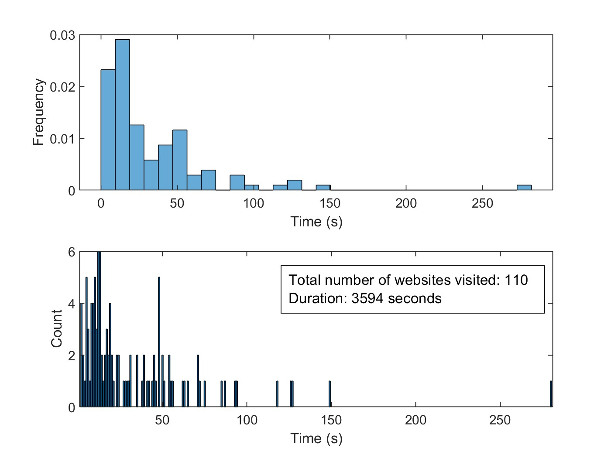

# SelectTimeIntervals

This MATLAB code generates random time intervals for browsing websites based on specified parameters. It calculates the total number of counts and the total time spent browsing and visualizes the results using histograms and bar plots.

## Usage

1. Run the `SelectTimeIntervals.m` file in MATLAB.
2. Set the desired values for the following parameters:
   - `totalTime`: Total browsing time in seconds.
   - `minTime`: Minimum browsing time per website in seconds.
   - `maxTime`: Maximum browsing time per website in seconds.
   - `lambda`: Rate parameter for the exponential distribution.
3. Execute the code to generate the browsing times and visualize the results.

## Output

The code generates a histogram and a bar plot to represent the distribution of browsing times. Additionally, it displays the total number of websites visited and the duration of the browsing session.

Sample output: 

## Requirements

- MATLAB software environment

## Notes

- The `truncatedExponentialRandom` function is defined within the code to draw random values from a truncated exponential distribution.
